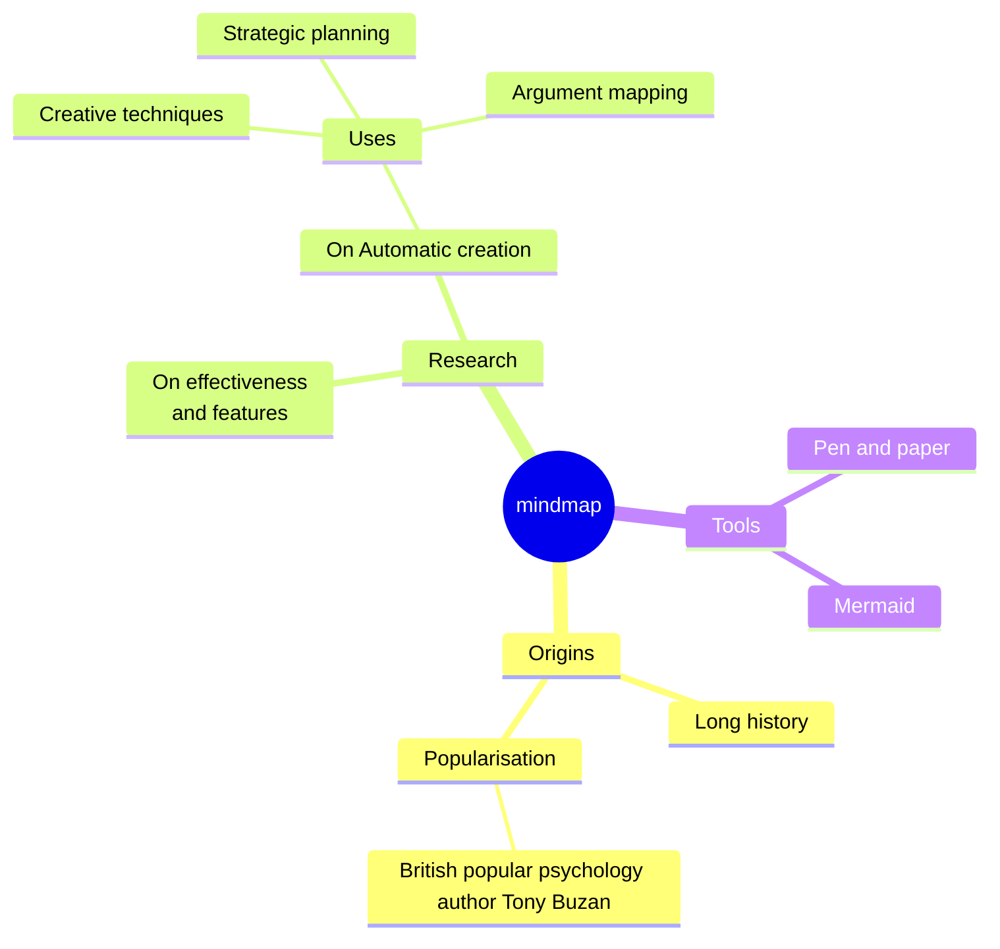

typora 支持的流程图、序列图、思维导图相关语法。

<!--more-->
# Flow Charts

相关文档：

[https://flowchart.js.org(opens new window)](https://flowchart.js.org/)

[https://github.com/adrai/flowchart.js(opens new window)](https://github.com/adrai/flowchart.js)

~~~md
```flow
st=>start: Start:>http://www.google.com[blank]
e=>end:>http://www.google.com
op1=>operation: My Operation
sub1=>subroutine: My Subroutine
cond=>condition: Yes
or No?:>http://www.google.com
io=>inputoutput: catch something...
para=>parallel: parallel tasks

st->op1->cond
cond(yes)->io->e
cond(no)->para
para(path1, bottom)->sub1(right)->op1
para(path2, top)->op1
```
~~~


# Sequence Diagrams

相关文档：

[https://bramp.github.io/js-sequence-diagrams/(opens new window)](https://bramp.github.io/js-sequence-diagrams/)

~~~md
```sequence
Andrew->China: Says Hello
Note right of China: China thinks\nabout it
China-->Andrew: How are you?
Andrew->>China: I am good thanks!
```
~~~


# Mermaid

相关文档：

[https://github.com/mermaid-js/mermaid(opens new window)](https://github.com/mermaid-js/mermaid)

[https://mermaid.js.org/intro/(opens new window)](https://mermaid.js.org/intro/)

~~~md

~~~


